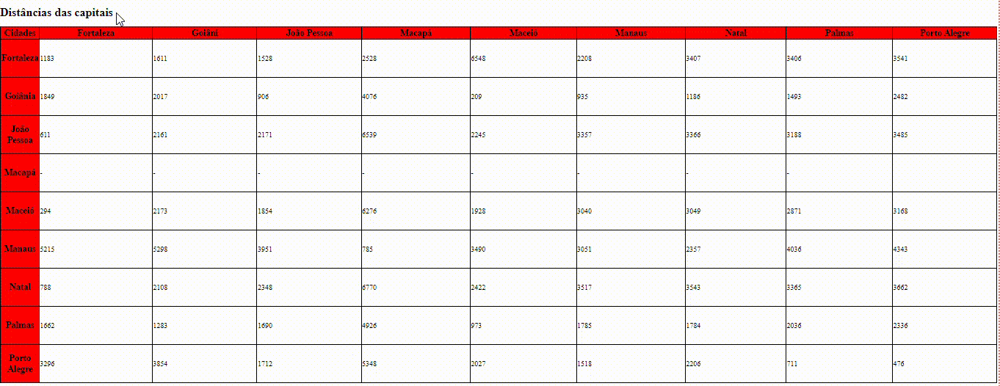

# Índice

* [Projeto escrita do README](#projeto-escrita-do-readme)
* [Descrição](#descri%C3%A7%C3%A3o)
* [Introdução](#introdu%C3%A7%C3%A3o)
* [Funcionalidades](#funcionalidades)
* [Tecnologias utilizadas](#tecnologias-utilizadas)
* [Fontes utilizadas](#fontes-utilizadas)
* [Autores](#autores)

# Projeto escrita do README



# Descrição

Projeto aonde deveríamos criar uma tabela que mostrava as distâncias entre as capitais brasileiras.

# Introdução

No projeto foi indicado que deveriamos fazer esse projeto em um trio, aonde cada membro do grupo fez 9 capitais, totalizando 27 capitais.

# Funcionalidades

Serve como um facilitador que mostra todas as distâncias entre as capitais brasileiras.

# Tecnologias utilizadas

## CSS

## HTML5

### Table

```
<td>  
<th>
<tr>
```

## Fontes utilizadas  

 O professor Leonardo providenciou uma folha que mostrava as distâncias das capitais usadas no projeto.

## Autores

Deivid Lucas